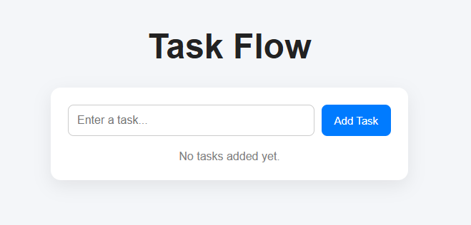
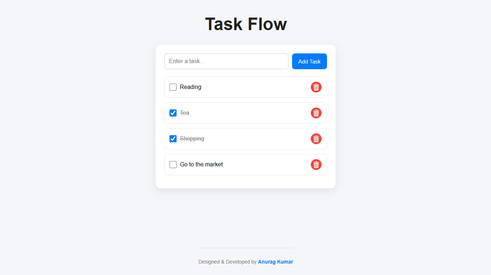
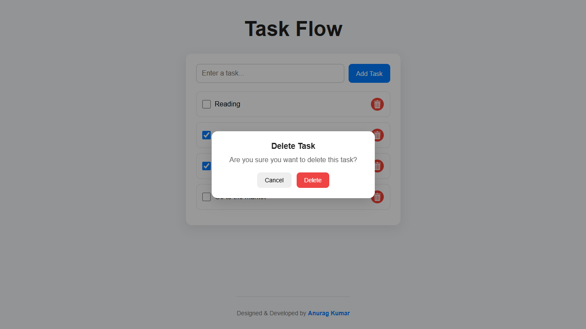

# Task Flow

> A full-stack task management application that helps users organize daily activities by creating, updating, completing, and deleting tasks efficiently.


---

# Features

✅ Add new tasks  
✅ Mark tasks as completed  
✅ Delete tasks instantly  
✅ Update task status  
✅ Persistent task storage with MongoDB  
✅ Responsive and modern UI  
✅ Fast and lightweight performance  
✅ MVC backend architecture  

---

# Screenshots

### Task Flow
<p align="center">
  
</p>

### List
<p align="center">
  
</p>

### Delete
<p align="center">
  
</p>

---

# Tech Stack

## Frontend

| Technology | Purpose |
|------------|---------|
| HTML5 | Structure |
| CSS3 | Styling & Responsive Design |
| JavaScript | Client-side Logic |


## Backend

| Technology | Purpose |
|------------|---------|
| Node.js | Runtime Environment |
| Express.js | Backend Framework |
| MongoDB | Database |
| Mongoose | Database Modeling |

---

# Getting Started

### Environment Variables

Create a `.env` file inside `server/`

```env
PORT=5000
MONGO_URI=mongodb://127.0.0.1:27017/todoDB
```

### 1️. Clone the Repository

```bash
git clone https://github.com/Anurag-3112/task-flow.git
```


### 2️. Navigate to the Project Folder

```bash
cd task-flow
```


### 3️. Install Dependencies

```bash
cd server
npm install
```


### 4️. Start MongoDB

Make sure MongoDB is running locally on your machine.


### 5️. Start the Backend Server

```bash
node server.js
```

Server runs on:

```bash
http://localhost:5000
```


### 6️. Run the Frontend

Open:

```bash
index.html
```

in your browser  
or use **Live Server** in VS Code.

---

# How It Works

1. Create a new task  
2. Store tasks in MongoDB  
3. Mark tasks as completed  
4. Update or delete tasks anytime  
5. Manage daily activities efficiently  

---

# Project Structure

```bash
task-flow/
│
├── client/
│   ├── index.html
│   ├── style.css
│   └── script.js
│
├── server/
│   ├── server.js
│   ├── .env
│   ├── package.json
│   │
│   ├── config/
│   │   └── db.js
│   │
│   ├── controllers/
│   │   └── todoController.js
│   │
│   ├── middleware/
│   │   └── errorHandler.js
│   │
│   ├── models/
│   │   └── Todo.js
│   │
│   └── routes/
│       └── todoRoutes.js
│
└── assets/
    ├── image1.png
    └── image2.png
```

---

# Future Improvements

- [ ] User authentication system
- [ ] Task deadlines and priorities
- [ ] Filters for completed/pending tasks
- [ ] Drag-and-drop task management
- [ ] Dark / Light mode
- [ ] Deploy frontend and backend online

---

# What I Learned

This project helped me improve my understanding of:

- REST APIs
- CRUD operations
- MongoDB integration
- Backend development with Express.js
- Database modeling using Mongoose
- Frontend and backend communication

---

# Contributing

Contributions are welcome!

If you'd like to improve this project:

1. Fork the repository
2. Create a feature branch
3. Commit your changes
4. Open a Pull Request

---

# Author

### Anurag Kumar

Frontend Developer | JavaScript Enthusiast

GitHub: [@Anurag-3112](https://github.com/Anurag-3112)

---

# ⭐ Support

If you like this project, consider giving it a ⭐ on GitHub!
